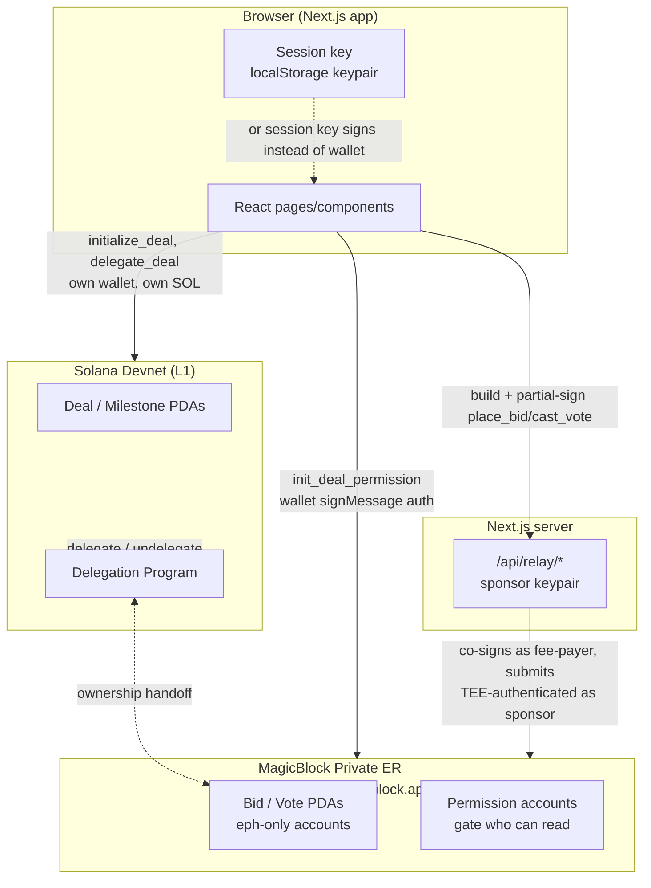

# Architecture

AVS (Anonymous Venture Syndicate) lets a startup post an investment deal,
lets angels place bids nobody else can read — not other bidders, not the
startup — until a fixed deadline, then reveals every bid at once and
allocates equity proportionally. Syndicate members then vote privately on
milestones, with rewards settled after the vote reveals.

The privacy property is not client-side encryption. It's **access control**:
bid and vote accounts live on a MagicBlock Ephemeral Rollup (ER) behind a
Private Ephemeral Rollup Permission (PER) that names only the bidder and the
startup as readers, until an on-chain `reveal_*` instruction runs after the
deadline and makes the tally public. "Sealed" means access-controlled, not
ciphertext.

## System overview



## On-chain programs

Three Anchor programs, deployed to Devnet:

| Program | Purpose | Program ID |
|---|---|---|
| `sealed-auction` | Deal creation, sealed bidding, reveal, proportional settlement | `Bycx3bB2yrFMYWSvi2Yjxutrt1QoVuYyzn37T6ys9YYo` |
| `private-voting` | Milestone proposals, sealed voting, reveal, VRF-gated reward settlement | `ErRYzAmuTFGHQSzZ7A38zX2rmwosGxDYTvPtPCSPq4Qs` |
| `spl-token-manager` | Syndicate equity mint + member-to-member transfers | `fNkSCkp2szKMND8ouKwfxNpGqhAsnCdQ4PTzsxnDKa3` |

Forked from MagicBlock's own `sealed-auction`/`binary-prediction` examples
(see `vendor/magicblock-engine-examples/`), with the domain reshaped from a
winner-take-all auction into a proportional multi-investor syndicate: every
accepted bid becomes a position sized by its share of the total raised —
there's no losing bidder and no refund path.

### sealed-auction — `Deal` / `Bid`

```rust
pub struct Deal {
    pub startup: Pubkey,
    pub deal_id: u64,
    pub funding_mint: Pubkey,       // token bidders pay with
    pub valuation: u64,
    pub equity_bps: u16,           // 0-10_000, share of company offered
    pub min_investment: u64,
    pub max_cap: u64,               // soft target, not enforced on-chain
    pub deadline_ts: i64,
    pub bid_count: u8,
    pub closed_bid_count: u8,
    pub total_raised: u64,          // zero until reveal_deal
    pub status: DealStatus,         // Open -> Revealed -> Settled
    pub oversubscribed: bool,
    pub cliff_months: u16,
    pub vesting_months: u16,        // informational only — no on-chain vesting
}

pub struct Bid {
    pub deal: Pubkey,
    pub bidder: Pubkey,
    pub amount: u64,
    pub bidder_index: u8,
    pub escrow: Pubkey,
    pub equity_allocated: u64,      // computed once, at reveal_deal
}
```

Instruction sequence for one deal's full lifecycle:

```mermaid
sequenceDiagram
    participant Startup
    participant L1 as Devnet L1
    participant ER as Private ER
    participant Investor

    Startup->>L1: initialize_deal (creates Deal PDA + funding ATA + its ephemeral shadow ATA)
    Startup->>L1: delegate_deal (hands Deal PDA to the Delegation Program)
    Startup->>ER: init_deal_permission (TEE-authenticated as startup)
    Investor->>ER: place_bid (TEE-authenticated as investor/session key; sponsor pays rent+fee)
    Startup->>ER: init_bid_permission (per bid, seals it to bidder+startup only)
    Note over ER: after deadline_ts...
    Startup->>ER: reveal_deal (sums every bid via remaining_accounts, sets total_raised)
    Startup->>ER: settle_bid (per bid: proportional equity math, SPL transfer to startup)
    Startup->>ER: undelegate_deal (commits state back to L1) — currently broken, see Known Issues
```

Equity math in `settle_bid`, exactly:

```
equity_allocated = bid.amount / deal.total_raised * deal.equity_bps / 10_000 * EQUITY_TOTAL_SUPPLY
```

`EQUITY_TOTAL_SUPPLY` is `1_000_000_000_000` (1,000,000.000000 tokens at 6
decimals) — the full notional cap table for *that deal's* equity mint. Every
deal gets its own fresh mint (see `spl-token-manager`), so this isn't shared
across deals.

### private-voting — `Milestone` / `Vote`

Structurally identical pattern to sealed-auction: `initialize_milestone` →
`delegate_milestone` → `init_milestone_permission` → `cast_vote` (sealed
YES/NO) → `init_vote_permission` → `reveal_milestone` (tallies
`yes_count`/`no_count`, sets `Outcome::{Yes,No,Tie}`) → `settle_vote` →
`undelegate_milestone`.

One addition: reward settlement is gated on a verifiable random function.
`request_milestone_randomness` requests it from MagicBlock's ephemeral VRF
(`ephemeral_rollups_sdk`'s `#[vrf]`/`#[vrf_callback]` macros — not
`orao-solana-vrf`, despite what older docs in this repo say);
`milestone_randomness_callback` receives it and sets
`Milestone.randomness`/`randomness_fulfilled`; `settle_vote` won't pay out
until that flag is true. This VRF round-trip has not been exercised live in
this repo's test suite — see Known Issues.

`Milestone.deal` links back to a `sealed-auction` Deal, but this is
informational only — not CPI-verified. A milestone can currently be created
against any pubkey passed as `deal`, with no check that it's a real,
existing deal.

### spl-token-manager — `Syndicate`

One `Syndicate` per deal, created after that deal reveals:
`create_syndicate` (mints a fresh equity token, `syndicate` PDA becomes its
mint authority) → `mint_equity` (per member, to their real SPL ATA) →
`delegate_equity_account` (member delegates their own equity ATA to the ER)
→ `transfer_equity` (a plain SPL transfer — the "gasless" property comes
entirely from sending this same instruction to the ER RPC against a
delegated account, not from any special flag) → `undelegate_equity_account`.

`Syndicate.deal` has the same informational-only, not-CPI-verified
relationship to `sealed-auction` as `private-voting`'s does.

## The Ephemeral Rollup / Private ER Permissions model

Bid and vote accounts (`eph`-only in Anchor's `#[ephemeral_accounts]` macro)
exist **only** on MagicBlock's hosted Private Ephemeral Rollup — never on
L1. Reading or writing them requires a **TEE-authenticated connection**:

```
RPC:        https://devnet-tee.magicblock.app
WS:         wss://devnet-tee.magicblock.app
Validator:  MTEWGuqxUpYZGFJQcp8tLN7x5v9BSeoFHYWQQ3n3xzo   (used in DelegateConfig)
```

Authentication (`@magicblock-labs/ephemeral-rollups-sdk`'s `getAuthToken`) is
a challenge-response: sign an arbitrary message with the identity you're
authenticating as, get back a short-lived token, append it to the RPC/WS
URL as a query param. Two different identities authenticate for two
different reasons in this app:

- **The relay sponsor** (`frontend/lib/relayServer.ts`) authenticates with
  its own held keypair, server-side, to submit `place_bid`/`cast_vote` and
  to hand out a valid ER blockhash — see [RELAY.md](RELAY.md).
- **The connected wallet** (`frontend/lib/ephemeralRollup.ts`) authenticates
  via `wallet.signMessage`, browser-side, for actions the *user* does
  themselves rather than the relay — currently just `init_deal_permission`
  when creating a deal.

A delegated account's L1 copy still decodes fine via a normal
`program.account.<Type>.fetch()`/`.all()` call (Anchor doesn't check
current owner, just deserializes the raw bytes) — but it's frozen at
whatever state it had at the moment of delegation. `useDeal`/`useDeals`
read this way and correctly show a freshly-created "Open" deal; they won't
show live `bid_count` changes or a transition to "Revealed"/"Settled" until
the deal is undelegated and its state committed back to L1.

### Two additional one-time delegation steps most flows need

Beyond delegating the `Deal`/`Milestone` PDA itself, an SPL token account
that already holds a real balance needs to be **separately** delegated to
the ER via `delegateSpl()` before any ER-side transfer involving it can see
that balance — the ER genuinely has zero for it otherwise. This applies to:

- An investor's own funding-token account, before their first `place_bid`
  on any deal (`frontend/lib/ephemeralDelegation.ts`, paid by the investor's
  own wallet since it isn't part of any single bid).
- A syndicate member's equity account, before `transfer_equity` can move it
  gaslessly on the ER — **currently broken**: `delegate_equity_account`
  only initializes the shadow account, never deposits the existing balance
  into it (see [KNOWN_ISSUES.md](KNOWN_ISSUES.md)).

## Session keys

See [SESSION_KEYS.md](SESSION_KEYS.md) for the full design. In short: a
disposable keypair generated in the browser and authorized with one real
wallet signature (via `@magicblock-labs/gum-sdk`'s `SessionTokenManager`,
`createSessionV2`/`revokeSessionV2`), stored in `localStorage`. Once
authorized, it can sign `place_bid`/`cast_vote` on the investor's behalf
until it expires (default 1 hour) or is revoked — no wallet popup per bid
or vote. The program-side check is a PDA-seed binding
(`[session_token_v2, program_id, session_signer, real_authority]`) plus a
runtime expiry check; a session minted for one investor can't be reused for
a different one (proven live in `tests/session-keys.ts`).

## The relay backend

Investors and voters never need their own devnet SOL. See
[RELAY.md](RELAY.md) for the full design — in short, a small Next.js API
(`app/api/relay/{sponsor,blockhash,submit}`) backed by one funded keypair
that co-signs `place_bid`/`cast_vote` as fee-payer/rent-sponsor, with a
program-ID allowlist so it can't be repurposed as a general-purpose relay.

## Frontend

Next.js 14 (App Router) + React 18 + TypeScript, Tailwind for styling
(semantic CSS-variable tokens, not raw Tailwind colors — `frontend/app/
globals.css`), Framer Motion for animation, Recharts for charts,
`@solana/wallet-adapter-react` for wallet connection, `@coral-xyz/anchor`
for program clients.

```
frontend/
├── app/            Pages (App Router) — deals, dashboard, vote, analytics,
│                   syndicates, chat, settings, status, about/faq/legal,
│                   plus api/relay/* route handlers
├── components/      Shared UI (BidForm, VoteCard, DealCard, charts, ...)
├── hooks/           useDeal(s), useBids, useMilestones, usePortfolio, ...
└── lib/
    ├── programs.ts          Program IDs, PDA derivation, Anchor clients
    ├── sessionKeys.ts        Session key create/load/revoke
    ├── relayServer.ts        Server-only: sponsor keypair, ER auth, allowlist
    ├── relayClient.ts        Client helpers for the relay's HTTP API
    ├── ephemeralRollup.ts     Client-side wallet-signMessage ER auth
    ├── ephemeralDelegation.ts Investor funding-account delegation check/action
    ├── chatStore.ts          Zustand store — local-only placeholder, see
    │                          its own doc comment for the planned on-chain
    │                          ephemeral-account-chats upgrade
    └── mappers.ts, format.ts, csv.ts, types.ts, theme.ts
```

`hooks/useDeal.ts`/`useDeals.ts` (and the milestone/syndicate equivalents)
read via a plain Devnet L1 `Connection` — see the ER section above for what
that does and doesn't show once a deal is delegated.

## Known limitations

See [KNOWN_ISSUES.md](KNOWN_ISSUES.md) for full detail and repro steps on:
`undelegate_deal`/`undelegate_milestone` failing with
`ExternalAccountDataModified`, `delegate_equity_account` never depositing
an existing balance, and `undelegate_equity_account` using the wrong
builder for a Token-program-owned account. None of these block the
privacy-critical bidding/voting path — only the final "commit state back
to L1" administrative step.

Also not yet done: the milestone-VRF settlement round-trip
(`request_milestone_randomness` → oracle callback → `settle_vote`) hasn't
been exercised against real infrastructure — it needs an oracle queue
address this repo doesn't have a verified source for yet.
